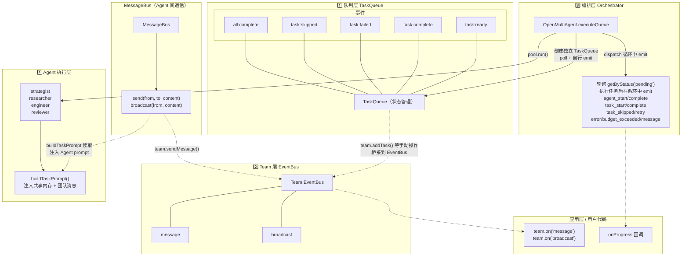

# 四层事件架构

日期: 2026-05-29

基于 `examples/cookbook/four-layer-events.ts` 总结的事件架构图。

## 四层事件总览



## 事件流: 线性管线

```
时间线         strategist    researcher    engineer    reviewer
                (Task 1)      (Task 2)      (Task 3)    (Task 4)
                 │              │             │           │
    system ──broadcast──→ 全员收到 ─────→ 全员收到 ──→ 全员收到
    system ──send──→ strategist
                 │
                [执行]──complete──→ onProgress(task_complete)
                 │                  onApproval 触发
                 ├────send────────→ researcher
                 │                                   
                                  [执行]──complete──→ onProgress(task_complete)
                                   │                  onApproval 触发
                                   ├────send────────→ engineer
                                   │
                                                    [执行]──complete──→ onProgress(task_complete)
                                                     │                  onApproval 触发
                                                     ├────send────────→ reviewer
                                                     │
                                                                      [执行]──complete──→ onProgress(task_complete)
                                                                       │
                                                                     管线结束 → all:complete
```

## 各层事件明细

### 队列层事件（TaskQueue）

| 事件 | 发射时机 | 数据 |
|------|---------|------|
| `task:ready` | 任务加入时依赖已满足，或依赖完成后 unblock | Task |
| `task:complete` | `complete()` 调用 | Task (含 result) |
| `task:failed` | `fail()` 或 `cascadeFailure()` | Task (含 error) |
| `task:skipped` | `skip()` 或 `cascadeSkip()` | Task (含 reason) |
| `all:complete` | 所有任务进入终态 | 无 |

注意：`runTasks` / `runTeam` 内部使用独立 TaskQueue，队列事件不经过 Team 的 EventBus 桥接。

### Team 层事件（EventBus 桥接）

| 事件 | 来源 | 触发条件 |
|------|------|---------|
| `message` | `team.sendMessage()` | 点对点消息 |
| `broadcast` | `team.broadcast()` | 全员广播 |
| `task:ready` | 桥接 Team 内部 TaskQueue | 仅手动操作时 |
| `task:complete` | 桥接 Team 内部 TaskQueue | 仅手动操作时 |
| `task:failed` | 桥接 Team 内部 TaskQueue | 仅手动操作时 |
| `all:complete` | 桥接 Team 内部 TaskQueue | 仅手动操作时 |

### 编排层事件（onProgress）

| 事件类型 | 含义 | 数据 |
|---------|------|------|
| `task_start` | 任务开始执行 | Task |
| `task_complete` | 任务成功完成 | AgentRunResult |
| `task_skipped` | 任务被跳过 | reason |
| `task_retry` | 任务失败后重试 | attempt, error |
| `agent_start` | Agent 开始运行 | task |
| `agent_complete` | Agent 运行结束 | AgentRunResult |
| `budget_exceeded` | 全局 token 预算超限 | Error |
| `message` | 团队消息 | Message |
| `error` | 任务失败 | AgentRunResult |

## 示例事件日志结构

```
[10:00:00.000] [queue          ] task:ready              "前置任务" (未分配)
[10:00:00.001] [queue          ] task:complete           "前置任务" ✅
[10:00:00.001] [queue          ] task:ready              "后置任务" (未分配)
[10:00:00.002] [queue          ] all:complete            队列所有任务已结束
[10:00:00.500] [team           ] broadcast               system → (全员广播)
[10:00:00.501] [team           ] message                 system → strategist
[10:00:00.502] [orchestrator   ] runTasks                开始执行 4 阶段任务管线
[10:00:00.503] [orchestrator   ] task_start              "架构设计" → strategist
[10:00:00.504] [orchestrator   ] agent_start             strategist
...  (strategist 执行中) ...
[10:01:30.000] [orchestrator   ] agent_complete          strategist
[10:01:30.001] [orchestrator   ] task_complete           "架构设计" ← strategist
[10:01:30.002] [team           ] message                 strategist → researcher
[10:01:30.003] [orchestrator   ] task_start              "技术调研" → researcher
```
