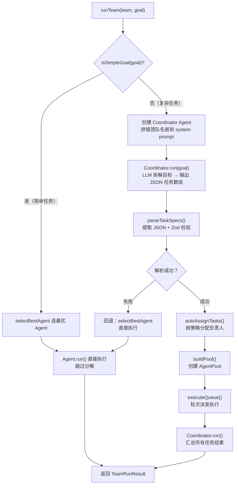
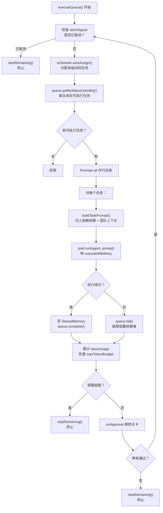
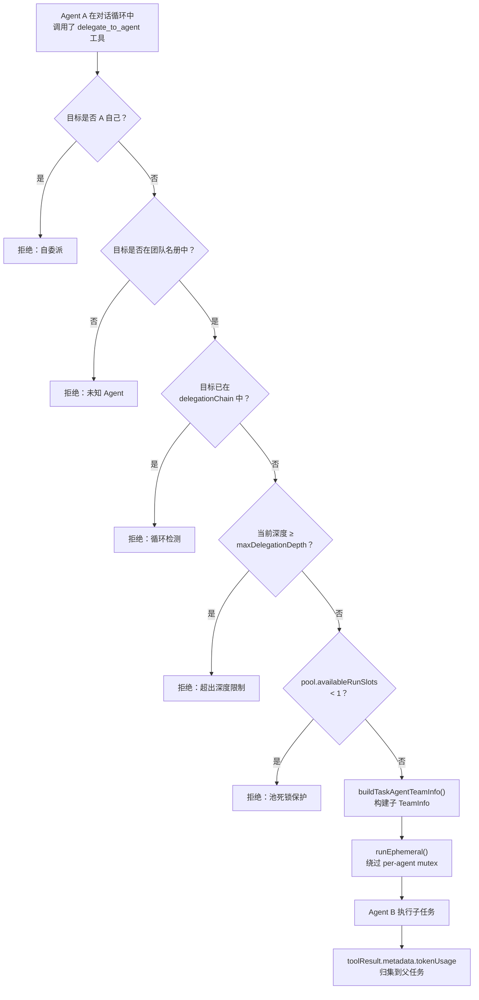

# 前置知识分层梳理
在深入 `orchestrator.ts` 之前，先搭建对应的基础知识体系，下文逐层拆解核心概念、代码逻辑与设计思想。

---

## 第一层：LLM 基础
编排层的多数设计决策，都建立在 LLM 原生能力之上。

### Chat API 基本语义
框架中 `LLMAdapter` 是对接各类大模型的统一抽象，核心接口定义如下：
```typescript
// LLMAdapter 核心接口
chat(messages: LLMMessage[], options?): Promise<LLMResponse>
```

`LLMMessage` 的角色分为三类：`system` / `user` / `assistant`。
LLM 本身**无状态**，每次调用都是独立会话。因此多 Agent 协作场景下，编排层必须自行维护三类数据：
- 全局状态：`SharedMemory`
- 任务上下文：通过 `buildTaskPrompt` 拼接生成
- 对话历史：Agent 内部的 `messageHistory`

### Tool Use / Function Calling
LLM 不仅能输出纯文本，还支持主动请求调用外部工具，这也是 Agent 执行循环的核心逻辑：
> LLM 回复 → 检测是否存在工具调用 → 存在则执行工具 → 工具结果追加到消息列表 → 再次调用 LLM → 循环往复

在编排体系中，`delegate_to_agent` 被设计为**特殊工具**：允许一个 Agent 像调用工具一样，委派任务给另一个 Agent。

### Structured Output（结构化输出）
通过指令约束 LLM 输出标准 JSON 格式，再做解析与合法性校验。
编排层中 `coordinator` 拆解目标任务，本质就是让 LLM 生成符合 `ParsedTaskSpec` 规范的结构化数据。

```typescript
interface ParsedTaskSpec {
  title: string
  description: string
  assignee?: string
  dependsOn?: string[]
  memoryScope?: 'dependencies' | 'all'
}
```
核心价值：将自然语言输出转为**可编程、可流转**的结构化数据。

---

## 第二层：Agent 核心模式
承接 `agent.ts`、`runner.ts` 原有逻辑，梳理编排层对 Agent 能力的复用规则。

### Agent 的三个执行方法
编排层与 Agent、运行引擎的调用关系如下图：
```
┌─────────────────────────────────────────────────┐
│ Orchestrator                                    │
│  runTeam / runTasks / runAgent                  │
│                                                 │
│   ┌──────────────────────────────────┐          │
│   │ Agent.run()   — 一次性，无历史    │          │
│   │ Agent.prompt() — 多轮对话        │          │
│   │ Agent.stream() — 流式输出        │          │
│   └──────────────────────────────────┘          │
│          │                                       │
│          ▼                                       │
│   ┌──────────────────────────────────┐          │
│   │ AgentRunner (对话循环引擎)        │          │
│   │  stream() → while true 循环       │          │
│   │  run()    → stream() 的聚合       │          │
│   └──────────────────────────────────┘          │
└─────────────────────────────────────────────────┘
```

编排层统一使用 `Agent.run()`：每次执行都会新建独立消息数组，**不会保留历史会话**，保证各个任务相互隔离、互不干扰；
而 `Agent.prompt()` 会保留对话历史，不适合独立任务场景。

### RunOptions 透传机制
`runner.ts` 定义了运行配置项，编排层会完整透传该配置，其中 `team` 是 Agent 委派能力的关键依赖。
```typescript
// runner.ts
interface RunOptions {
  abortSignal?: AbortSignal
  onMessage?: (msg: LLMMessage) => void
  onToolCall?: (call: ToolUseBlock) => void
  onToolResult?: (result: ToolResult) => void
  onTrace?: TraceCallback
  team?: TeamInfo  // 关键：delegate_to_agent 依赖该字段
}
```

编排层在 `executeQueue` 中构建运行配置时，会完成多项注入工作：链路追踪 `trace`、取消信号 `abortSignal`、团队信息 `team`（由 `buildTaskAgentTeamInfo` 构建），同时通过 `onAgentStream` 将流式事件转发给上层调用方。

---

## 第三层：多 Agent 编排模式（Orchestrator 核心）
理解本层内容，即可掌握编排器的主体设计逻辑。

### Coordinator 模式
框架核心特色能力，整体流程如下：
1. 临时创建一个 Coordinator Agent，接收团队信息与整体目标；
2. 由 LLM 自主拆解目标，生成若干子任务；
3. 按照任务依赖关系依次执行；
4. 所有子任务完成后，Coordinator 汇总最终结果。

命名说明：该角色仅负责**任务拆解 + 结果汇总**，任务下发后不再干预执行流程，因此命名为 Coordinator（协调者），而非 Manager / Leader（管理者）。

### 短路径优化（Short-circuit）
针对简单目标做性能优化，避免多余的 LLM 调用：
```typescript
if (isSimpleGoal(goal)) {
  // 筛选最合适的 Agent 直接执行，跳过 Coordinator 拆解环节
  return runAgent(selectBestAgent(goal, agents), goal)
}
```
逻辑：简单任务无需先拆解再执行，单次调用即可完成，减少开销。

### DAG 任务调度
任务并非普通队列，而是基于**有向无环图（DAG）** 做调度，示例拓扑关系：
```
Task A ──→ Task B ──→ Task D
               │
Task C ─────────┘
```

`TaskQueue` 本质是 DAG 拓扑执行器，核心规则：
- 拓扑排序：严格保证任务依赖顺序；
- 可运行任务筛选：每一轮取出所有**入度为 0** 的任务执行；
- 级联失败：单个任务执行失败，其所有下游子任务自动标记为 `blocked`（阻塞）。

### SharedMemory + MessageBus
多 Agent 之间共有三种通信方式，对比如下：

| 方式 | 适用场景 | 底层实现 |
| ---- | -------- | -------- |
| SharedMemory | 跨任务持久化共享数据 | 命名空间键值存储 |
| MessageBus | 点对点通信 / 全局广播消息 | 事件订阅机制 |
| buildTaskPrompt 注入 | 将前置任务输出拼接至当前任务提示词 | 字符串拼接 |

`orchestrator.ts` 主要使用 **SharedMemory + Prompt 注入** 的组合方案，核心代码逻辑：
```typescript
// 任务执行完成后，结果写入共享内存
await sharedMem.write(assignee, `task:${task.id}:result`, result.output)

// 后继任务读取依赖任务的结果
const depResults = task.dependsOn?.map(depId => {
  const depTask = queue.get(depId)
  return depTask?.result  // 读取已完成任务的执行结果
})
```

### Delegation（任务委派）
委派是特殊的跨 Agent 调用：Agent A 通过工具调用触发 Agent B，同步等待 B 返回结果。该能力并非编排默认流程，而是通过 `delegate_to_agent` 工具注入到工具调用循环中。

委派核心约束：
- 禁止自委派：Agent 不能调用自身；
- 循环检测：拦截 A→B→A 这类循环委派链路；
- 深度限制：默认最大委派层级为 3 层；
- 池死锁保护：资源池无可用席位时，直接拒绝委派请求。

---

## 第四层：并发与流程控制知识
负责管控多任务、多 Agent 的并发、限流、取消、配额等底层能力。

### Promise.all 并行批处理
`executeQueue` 的核心执行逻辑，采用**轮次并发**模型：
```typescript
// executeQueue 核心逻辑
const dispatchPromises = pending.map(async (task) => { ... })
await Promise.all(dispatchPromises)
```

执行规则：
1. 提取当前所有可运行任务；
2. 通过 `Promise.all` 整批并行派发执行；
3. 等待本轮所有任务完成后，再检索新一轮可运行任务；
4. 循环直至所有任务结束。

特点：单轮内任务并发执行，**轮与轮之间串行**；单个耗时任务会阻塞下一轮任务启动。

### Semaphore / AgentPool
`AgentPool` 做了双层并发限制，解决资源争抢与死锁问题：
```typescript
class AgentPool {
  poolSemaphore: Semaphore        // 全局整体并发上限
  agentMutex: Map<string, Semaphore>  // 单个 Agent 串行执行锁
  // 额外提供 runEphemeral：绕过单个 Agent 的串行锁
}
```

`runEphemeral` 设计目的：委派场景中，Agent A 调用 Agent B 时，若 A 持有自身串行锁，B 会一直等待，进而造成同步死锁；`runEphemeral` 可临时绕过单 Agent 锁，规避该问题。

### AbortSignal 合并
编排层存在两级取消信号：
- `run()` 中的 `timeoutMs`：单个 Agent 运行超时限制；
- Orchestrator 顶层 `abortSignal`：整个编排流程的全局取消信号。

每一轮任务派发前都会做校验：
```typescript
if (ctx.abortSignal?.aborted) {
  queue.skipRemaining('Skipped: run aborted.')
  break
}
```
一旦触发取消，直接跳过所有未执行任务并终止流程。

### Token Budget（令牌配额）
分为两级 Token 配额管控：
1. **团队全局配额**：`maxTokenBudget`，作用于整个编排流程，累计统计所有任务的 Token 消耗，超出配额则终止全部任务：
   ```typescript
   ctx.cumulativeUsage = addUsage(ctx.cumulativeUsage, result.tokenUsage)
   if (totalTokens > ctx.maxTokenBudget) {
     // 跳过所有剩余任务
   }
   ```
2. **单个 Agent 配额**：`RunnerOptions.maxTokenBudget`，限制单次 Agent 运行的 Token 上限，在 Runner 的流式循环中校验。

---

## 第五层：系统设计知识
偏向工程化能力，包含事件回调、人工介入、异常重试等通用架构设计。

### 事件驱动的进度报告
基于**观察者模式**实现运行进度上报，对外抛出标准化事件，监听方仅做数据观察，不干预主流程。
```typescript
config.onProgress?.({
  type: 'task_complete' | 'task_start' | 'task_retry' | 'error' | 'agent_start' | 'agent_complete' | 'budget_exceeded',
  task: task.id,
  agent: assignee,
  data: ...
} satisfies OrchestratorEvent)
```

### Approval Gate（人工审核关卡）
区别于只读的进度事件，`onApproval` 是**流程控制点**，实现「人在回路（human-in-the-loop）」能力。
每一轮任务执行完毕、下一轮启动前触发审核：
```typescript
if (config.onApproval) {
  const approved = await config.onApproval(completedThisRound, nextPending)
  if (!approved) {
    queue.skipRemaining('Skipped: approval rejected.')
    break
  }
}
```
审核不通过则直接终止整个编排流程。

### Retry with Exponential Backoff（指数退避重试）
统一封装带重试能力的执行函数，支持自定义延迟逻辑，方便单元测试解耦：
```typescript
export async function executeWithRetry(
  run: () => Promise<AgentRunResult>,
  task: Task,
  onRetry?: (data) => void,
  delayFn?: (ms) => Promise<void>,
): Promise<AgentRunResult>
```

设计亮点：`delayFn` 支持外部注入，测试场景可传入立即执行的空函数，无需真实等待延时。

---

---

## 流程图

### runTeam 全流程



### executeQueue 轮次循环



### delegation 委派流程



---

## 知识地图总结
| 层级 | 核心概念 | 对应代码文件 |
| ---- | -------- | ------------ |
| LLM 基础 | Chat API、Tool Use、Structured Output | adapter.ts、runner.ts |
| Agent 模式 | run/prompt/stream 方法、RunOptions 透传、TeamInfo 注入、运行钩子 | agent.ts、runner.ts |
| 多 Agent 编排 | Coordinator 模式、DAG 调度、短路径优化、SharedMemory、MessageBus、委派机制、自动分配 | orchestrator.ts、team.ts、memory/shared.ts、scheduler.ts、delegate.ts |
| 并发控制 | Promise.all 轮次并发、Semaphore、AgentPool、runEphemeral 死锁防护 | orchestrator.ts、pool.ts |
| 系统设计 | 事件驱动进度、人工审核关卡、指数退避重试、全局 Token 配额 | orchestrator.ts、task/queue.ts |

---

## buildTaskAgentTeamInfo 解析

一句话：给 `delegate_to_agent` 工具提供"调用其他 Agent"的能力。

### 服务对象

返回值被注入到 `RunOptions.team`，最终到达 `delegate_to_agent` 工具：

```
executeQueue() → pool.run() → agent.run() → runner.stream()
  → buildToolContext(options) → ToolUseContext.team
  → toolExecutor.execute(name, input, toolContext)
  → delegate_to_agent handler: context.team.runDelegatedAgent()
```

### 返回值结构

```typescript
return {
  name: ctx.team.name,          // 团队名
  agents: agentNames,           // 所有团队成员列表
  sharedMemory,                 // 共享存储
  delegationDepth,              // 当前嵌套深度
  maxDelegationDepth: maxDepth, // 最大深度限制
  delegationPool: ctx.pool,     // 并发池
  delegationChain,              // 委派链路追踪
  runDelegatedAgent,            // ← 核心：真正干活的函数
}
```

前面的字段是"信息"，`runDelegatedAgent` 才是"能力"。

### 闭包设计

`runDelegatedAgent` 不是普通函数，而是闭包——捕获了 `ctx` (RunContext)：

```typescript
const runDelegatedAgent = async (targetAgent: string, prompt: string) => {
  pool.availableRunSlots      // 检查并发槽位
  agentConfigs.find(...)       // 找目标 Agent 配置
  ctx.config.defaultProvider   // 继承默认 provider
  ctx.revealCoordinatorContext // 是否暴露团队上下文
  // ...
}
```

### 执行路径

1. `delegate_to_agent` 工具接收到 `TeamInfo.runDelegatedAgent`
2. 检查可用槽位 → 不够则拒绝（死锁预防）
3. 检查 B 是否在名册中 → 不在则拒绝
4. 用 B 的配置 + 全局默认值，new 一个临时 Agent（干净会话）
5. **递归**调用 `buildTaskAgentTeamInfo()`，depth+1，链路上追加 B
6. `pool.runEphemeral()` 执行 B
   - 遵守全局并发上限（poolSemaphore）
   - **绕过 per-agent 锁（agentMutex）** → 防死锁
7. 返回结果，token 归集到父任务

### 递归委派与保护

```typescript
const nestedTeam = buildTaskAgentTeamInfo(
  ctx, taskId, traceBase,
  delegationDepth + 1,
  [...delegationChain, targetAgent],
)
```

```
A (depth=0, chain=[A])
  → B (depth=1, chain=[A,B])
    → C (depth=2, chain=[A,B,C])  ← 深度没超 maxDepth，允许
      → A (depth=3, chain=[A,B,C,A]) ← 循环检测：A 已在 chain，拒绝
```

### 为什么用 runEphemeral？

对比 `pool.run()` 和 `pool.runEphemeral()`：

| 方法 | 全局并发锁 | per-agent 串行锁 | 适用场景 |
|------|-----------|-----------------|---------|
| `pool.run()` | 遵守 | 持有 | 编排层分配的正常任务 |
| `runEphemeral()` | 遵守 | **绕过** | delegation 子任务 |

如果不绕过：A 持有自己的锁，在等 B 返回；B 要调 A 时需拿 A 的锁 → 死锁。

### 总结

这个函数的本质是：**把编排层的能力（pool、sharedMemory、团队配置）装进一个闭包，注入到 Agent 的工具箱里，让 Agent 在对话循环中能调用同事**。

---

## TeamInfo 传递链（orchestrator → delegate_to_agent）

从 `executeQueue` 到 `delegate_to_agent` 工具，中间经过 5 层传递，各层完全解耦：

```
层1: orchestrator.ts  executeQueue()
     第 660-663 行
     → 构造 runOptions，注入 team
       runOptions.team = buildTaskAgentTeamInfo(ctx, ...)

层2: orchestrator.ts
     第 669 行
     → pool.run(assignee, prompt, runOptions)
       ↓
     → agent.run(prompt, runOptions)

层3: agent.ts  executeRun()
     第 230 行
     → runner.run(messages, runOptions)
       ↓
     → runner.stream() 收到 options

层4: runner.ts  工具执行循环
     第 1062 行
     const toolContext = this.buildToolContext(options)
       ↓
     第 1579-1588 行
     buildToolContext() 读取 options.team
     → 放进 ToolUseContext.team

层5: runner.ts
     第 1075-1078 行
     this.toolExecutor.execute(block.name, block.input, toolContext)
       ↓
     → ToolExecutor 把 ToolUseContext 传给工具 handler

层6: delegate.ts
     第 31-35 行
     async execute(input, context: ToolUseContext) {
       const team = context.team      ← 这里取到 team
       team.runDelegatedAgent(...)    ← 这里调用委派
```

关键设计：数据通过参数对象逐层透传，没有直接的函数调用。每层只知道自己收到了什么、传给下一层：
- orchestrator 不知道 delegate_to_agent 的存在
- runner 不知道 team 的具体结构
- delegate 不关心 team 是怎么来的

---

## 为什么需要委派

核心原因：**执行中才会出现的需求，应该在执行中就地解决，而不是回到规划层重新调度。**

### DAG 调度的局限

| | DAG 调度（executeQueue） | Delegation |
|--|------------------------|------------|
| 谁触发 | orchestrator（顶层） | Agent 自己在对话循环中 |
| 何时决定 | 目标分解时（plan time） | 执行中需要时（runtime） |
| 是否同步 | 编排层等所有任务完成 | 同步等待，拿了结果继续 |
| 可见性 | orchestrator 知道所有任务 | orchestrator 不感知 |

典型场景：writer 写 React 性能报告，写到一半发现需要一个 benchmark 数据。coordinator 在分解阶段**无法预测**这个需求，只有 writer 看到 researcher 的输出后、结合自己的领域知识才能判断。

### 对比无委派的替代方案

无委派时只能 text 输出"建议查一下"——这个建议要么被人看到，要么丢失。writer 的能力止步于输出文本。

有委派时 writer 直接在对话循环中调用同事，拿到结果继续写。**让决策发生在信息最充分的地方**。

### 如果让 orchestrator 中介

不现实，因为对话会断裂：

```
writer → "我需要 Windows benchmark" → 对话暂停
orchestrator 调度 researcher → 完成 → 写 SharedMemory
writer 被重新唤醒 → 需要重建上下文才能继续
```

tool-use 的执行模型天然是"同步等待 + 继续"，刚好匹配"我需要一个东西，等拿到再继续"的场景。

---

## 为什么委派是内置工具调用

### 复用现有的工具执行基础设施

Agent 的工具执行循环已经提供：
- **并行** — Promise.all 执行多个工具
- **错误处理** — 抛异常 → isError 消息
- **结果格式化** — 自动转 tool_result block 追加回对话
- **token 归集** — 对每个工具结果做 token 处理

另建一套机制等于重写工具循环。

### LLM 原生理解

对 LLM 来说，`delegate_to_agent` 只是一个返回特定格式结果的工具。它不需要学新的交互协议。

### 语义匹配

工具调用 = 调用 → 等待执行 → 拿到结果 → 继续。
委派 = 委派 → 等待同事完成 → 拿到结果 → 继续。

语义完全一致。如果委派是异步事件，对话流程就断了——agent 发出请求后不知道自己该干什么，结果回来了也不知道怎么接上。

### 总结

> 如果你已有的系统能把 X 和 Y 都当作"插件"处理，那就不要把 Y 做成特殊的内置模块。