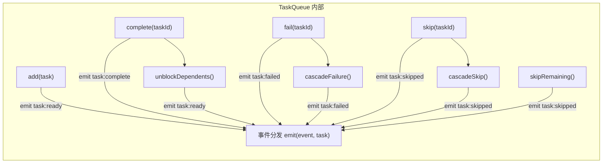
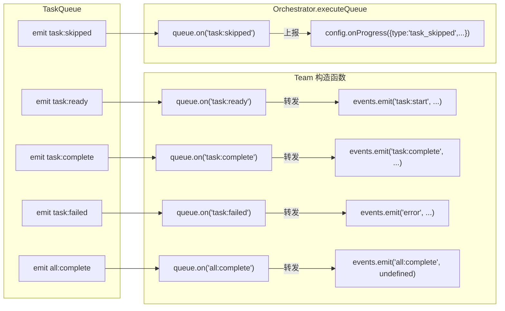
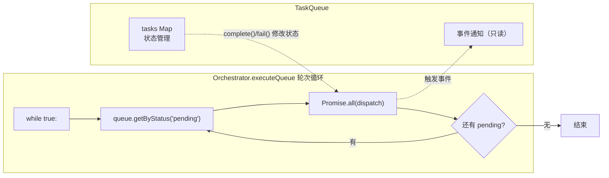

# 任务队列层

日期: 2026-05-29

基于 `src/task/task.ts`、`src/task/queue.ts` 总结。

## 分层结构

```
task/task.ts    — 纯函数，无状态。工厂、校验、拓扑排序
task/queue.ts   — 有状态的事件驱动队列。依赖解析、状态管理
```

分离动机：纯函数可独立测试，不依赖 `TaskQueue` 实例。

## task.ts — 纯函数层（127 行）

### createTask()

```typescript
createTask({
  title: 'Research competitors',
  description: 'Identify top 5...',
  assignee: 'researcher',
  dependsOn: ['task-a-id'],
})
// 生成 UUID、createdAt/updatedAt
```

### isTaskReady()

判断任务是否能执行：所有 `dependsOn` 中的任务都是 `completed`。

```typescript
isTaskReady(task, allTasks, taskById?)
```

第三个参数 `taskById` 是性能优化——批量调用时预建 map，复杂度从 O(n²) → O(n)。

### getTaskDependencyOrder() — 拓扑排序

Kahn's algorithm（BFS 版）：

1. 计算每个节点入度
2. 入度为零的节点入队
3. 弹出 → 加入结果 → 后继入度减一 → 入度为零的入队
4. 循环直到队列空

有环时返回**部分结果**，需配合 `validateTaskDependencies` 使用。

### validateTaskDependencies() — 依赖图校验

两遍扫描：

```
Pass 1 — 检查未知依赖和自依赖
Pass 2 — DFS 三色标记法检测环
  white (0) = 未访问
  grey  (1) = 正在访问（发现 → 环）
  black (2) = 已访问完毕
```

## queue.ts — 状态层（470 行）

### 状态机

```
                  ┌─────────┐
                  │ pending  │ ←── 刚到、或被 unblock
                  └────┬────┘
                       │
              ┌────────┼────────┐
              ▼        ▼        ▼
          ┌──────┐ ┌──────┐ ┌──────┐
          │  in   │ │blocked│ │failed│
          │progress│ │       │ ← cascade
          └───┬───┘ └──────┘ └──────┘
              │         │
              ▼         ▼
          ┌──────┐ ┌──────┐
          │compl. │ │skipped│ ← cascade
          └──────┘ └──────┘
```

| 状态 | 含义 |
|------|------|
| `pending` | 依赖已满足，等待执行 |
| `blocked` | 有依赖未完成 |
| `in_progress` | 正在执行 |
| `completed` / `failed` / `skipped` | 终态 |

### 三个级联方法

| 方法 | 触发 | 传播方式 |
|------|------|---------|
| `cascadeFailure` | `fail()` | 所有 `blocked/pending` 且依赖失败任务的 → 递归标记为 `failed` |
| `cascadeSkip` | `skip()` | 同上，标记为 `skipped` |
| `unblockDependents` | `complete()` | 所有 `blocked` 中依赖满足的 → 升为 `pending`，emit `task:ready` |

`cascadeFailure` 和 `cascadeSkip` 是递归的：
```
A 失败 → B 失败（依赖 A）→ C 失败（依赖 B）
```

### unblockDependents 的 O(n) 优化

```typescript
private unblockDependents(completedId: string): void {
  const allTasks = Array.from(this.tasks.values())
  const taskById = new Map(allTasks.map(t => [t.id, t]))  // 预建 map

  for (const task of allTasks) {
    // 找到 blocked 且依赖 completedId 的任务
    // 传给 isTaskReady 避免每次重建 map
    if (isTaskReady({ ...task, status: 'pending' }, allTasks, taskById)) {
      // 升为 pending
    }
  }
}
```

### skipRemaining 的快照防御

```typescript
skipRemaining(reason: string): void {
  const snapshot = Array.from(this.tasks.values())  // 先快照
  for (const task of snapshot) {                     // 遍历快照
    // update() 会修改 this.tasks 但不影响快照
  }
}
```

因为 `update()` 修改 `this.tasks`，边遍历边改 Map 不可预测。先快照再遍历。

### 事件

| 事件 | 触发时机 |
|------|---------|
| `task:ready` | 任务变为 `pending`（新增或 unblock） |
| `task:complete` | `complete()` 调用 |
| `task:failed` | `fail()` 或 cascade |
| `task:skipped` | `skip()` 或 cascade |
| `all:complete` | 所有任务进入终态 |

### Task 优先级（`next` / `nextAvailable`）

```typescript
next(assignee?: string)    // 取指定 assignee 的 pending 任务
nextAvailable()            // 取任意未分配 assignee 的 pending 任务
                           // 全部有 assignee 则返回第一个 pending
```

## 关键设计

### 纯函数与状态分离

`isTaskReady` 和 `getTaskDependencyOrder` 写在 `task.ts` 而非 `queue.ts`，使得测试时无需构造队列实例：

```typescript
// 纯函数测试，无副作用
test('isTaskReady returns true when all deps completed', () => {
  expect(isTaskReady(task, [task, ...deps])).toBe(true)
})
test('topological sort handles diamond dependencies', () => {
  const ordered = getTaskDependencyOrder(tasks)
  expect(ordered.indexOf(a)).toBeLessThan(ordered.indexOf(d))
})
```

不需要 mock、不需要 setup。

### 职责边界

`TaskQueue` 只管**依赖管理和状态转换**，不碰执行。emit 事件后，谁去执行、怎么执行、并发还是串行，是上层 `executeQueue`（orchestrator）的事。

对比：

| 职责 | TaskQueue | Orchestrator.executeQueue |
|------|-----------|--------------------------|
| 依赖解析 | ✅ unblockDependents | ❌ |
| 状态管理 | ✅ complete/fail/skip | ❌ |
| 事件通知 | ✅ emit task:ready 等 | ❌ |
| 任务派发 | ❌ | ✅ parallel dispatch |
| 并发控制 | ❌ | ✅ AgentPool |
| 轮次循环 | ❌ | ✅ while true 轮次 |
| Approval Gate | ❌ | ✅ |

---

## 事件流转图

### TaskQueue 内部事件（emit → on）



### 谁订阅了这些事件



### 谁驱动执行（不是事件）



关键点：`executeQueue` 通过 `getByStatus('pending')` **轮询**获取可执行任务，而不是等 `task:ready` 事件触发调度。事件只用于**上报通知**（Team 桥接、onProgress 回调），不用于驱动执行。
